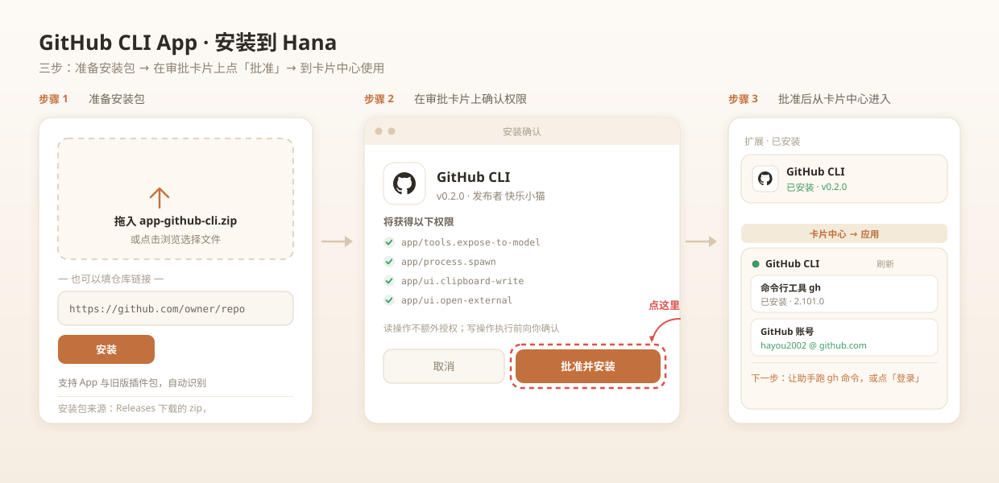
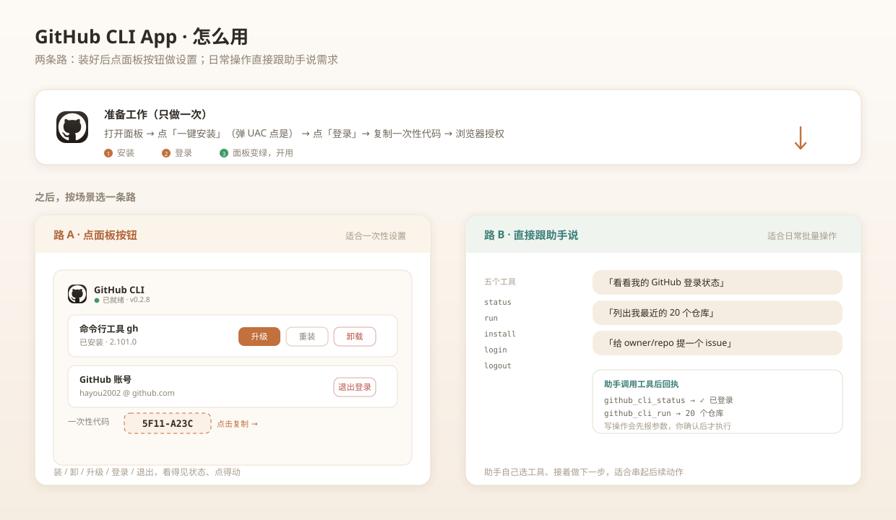

# GitHub CLI App for Hana

把官方 [GitHub CLI](https://cli.github.com)（`gh`）桥接为 [HanaAgent](https://github.com/liliMozi/openhanako) 工具的 v2 App。

装好之后，你的 AI 助手就能自己查登录状态、跑 `gh` 命令、引导你完成 GitHub 授权——不用再手动来回切换终端。本仓库的第一次真实任务，就是用这个 App 把它自己上传到了 GitHub。

## 特色功能

这几条是这个 App 真正花功夫做成的地方，也是它和“随便包一层 gh”的区别：

- **🎨 面板跟随宿主主题**——面板读宿主通过 iframe URL 下发的主题参数（`hana-css`），CSS 走 `--hana-*` → 旧主题名 → 默认值 的取值链。切到任意主题（包括自定义），面板的底色、主按钮、圆角跟着一起变，不会停在硬编码的橙色。
- **🧭 多源测速选源**——安装包下载前先对四条线路并发测速（GitHub 直连 + 三个加速镜像），挑最快的；当前源失败自动换下一个，全部失败再回退 winget。
- **🔐 提权安装**——Windows 上 MSI 静默安装/卸载必须管理员权限。面板里点一下会弹 UAC，确认后才执行（不用你手敲命令）。
- **🧩 一次性代码开箱即用**——点「登录」自动拉起后台轮询进程、解析出 `XXXX-XXXX` 一次性代码、并自动打开授权页；代码点一下就复制（三级兜底）。
- **🧱 安全执行边界**——所有子进程参数以数组直传（不走 shell），含 `<>|;&$` 等元字符的参数直接拒绝，没有通配/管道/变量展开。

## 特性一览

- 🖥 **管理面板卡片**：安装 / 登录 / 退出三段式交互。点「登录」→ 左侧出现可复制的一次性代码并自动弹出授权页；授权成功后面板自动变已登录；已登录时按钮变「退出登录」
- 🛠 **五个工具入驻模型**：状态诊断 / 一键安装 / 通用命令执行 / 双方式登录 / 退出登录，覆盖 gh 完整生命周期
- 🔌 **GitHub 直连纪律**：起子进程前自动清除残留的代理环境变量（`HTTP_PROXY` 等），不让陈旧配置阻断 GitHub 访问；直连瞬时失败时明确提示重跑而非误导去配代理
- 🧭 **登录全程引导**：设备码流程返回结构化三步操作指引，失败原因分类（网络瞬时干扰 / 需人工介入），后台轮询进程保证存活到授权完成
- 🔐 **令牌零经手**：token 登录经 stdin 直交 `gh auth login --with-token`，App 不落盘、不回显、不留副本；凭据由 gh 自己管理
- 🌐 **设备码流程**：启动 `gh auth login --web`，解析一次性代码返回给用户，浏览器点一下完成授权
- 🧱 **安全执行边界**：参数以数组直传 `execFile`，不经过 shell，无通配/管道/变量展开；含 shell 元字符的参数直接拒绝
- ⏱ **资源兜底**：默认 60s、上限 180s 超时；输出 60K 字符截断并提示用 `--jq`/`--limit` 收窄
- 🧯 **诊断友好**：gh 未安装时给出安装命令；命令失败时附带常见原因提示（未登录/无权限/不在仓库内）

## 环境要求

| 依赖 | 版本 | 说明 |
|---|---|---|
| HanaAgent | ≥ 0.1050.9 | 提供 v2 App 运行时 |
| GitHub CLI | ≥ 2.x | `winget install --id GitHub.cli` / `brew install gh` |

App 启动时按 `GH_CLI_PATH` 环境变量 → 平台默认安装路径 → `PATH` 中的 `gh` 依次解析可执行文件。

## 安装



**方式一：安装包（推荐）**

从 [Releases](../../releases) 下载 `app-github-cli-x.y.z.zip`，在 Hana 的扩展管理里选择本地安装，审阅权限后启用。

**方式二：从仓库安装**

在扩展管理的本地安装框里填入仓库链接，宿主会拉取默认分支的源码快照安装：

```
https://github.com/hayou2002/hana-github-cli
```

> 注意：这里填的是**仓库链接**（`github.com/owner/repo`），不是 Release 页链接。填 `.../releases/tag/vX.Y.Z` 虽也能装，但宿主只取前两段当仓库地址，抓的仍是源码快照，不会用 Release 里的 zip 资产。想用打包好的 zip，请走方式一。

**方式三：源码目录**

把 `github-cli/` 整个目录复制到 `<HANA_HOME>/apps/`，Hana 会在扩展面板的「应用」分类里列出待批准条目，确认后加载。

声明的权限共三条：

| 权限 | 用途 |
|---|---|
| `app/tools.expose-to-model` | 把五个工具注册给 AI 模型调用 |
| `app/process.spawn` | 以子进程方式执行 `gh` 命令 |
| `app/ui.clipboard-write` | 面板里一键复制一次性登录代码 |

> 浏览器打开授权页不由面板发起（iframe 沙箱里 `hana.external.open` 不可靠），而是走**后端** `cmd /c start`，所以不需要 `open-external` 能力。

## 管理面板

应用在 **卡片中心 → 应用** 标签下提供一张「GitHub CLI 管理面板」卡片：

| 区块 | 未就绪 | 就绪后 |
|---|---|---|
| 安装 | 「未安装」+ **一键安装** 按钮，安装日志实时回显 | 「已安装 · 版本号」 |
| 账号 | 「未登录」+ **登录** 按钮 | `账号 @ 主机 · 协议 · scope`，按钮变**退出登录** |

点「登录」后：左侧出现**可复制的一次性代码**，浏览器自动打开授权页；面板每 2.5 秒轮询，浏览器点完 Authorize，面板自动切到已登录。

## 工具说明

### `github_cli_status`

无参数。返回 `gh --version` 与登录账号/scope/协议摘要，用于环境体检和故障诊断；未安装 gh 时提示一键安装。

### `github_cli_install`

带三种模式（`mode: install | upgrade | uninstall`）：

- 会先对四条线路并发测速（直连 + 三个加速镜像），选最快源下载**官方 MSI** 并提权静默安装（弹 UAC）
- 当前源下载失败自动换下一个，全部失败回退 `winget`（Windows）/ `brew`（macOS）
- `upgrade` 时若已是最新版本会直接反馈、不做多余下载
- 下载缓存落在 App 自己的数据目录（`ctx.dataDir`），每次安装前清掉旧包

### `github_cli_run`

通用 `gh` 命令桥。核心参数：

- `args`（必填）：`gh` 之后的参数数组，如 `["repo","list","--limit","20"]`
- `cwd`（可选）：运行目录，git 上下文相关命令需要
- `timeoutMs`（可选）：超时毫秒数

读操作可直接执行；写操作（create / merge / delete 等）按约定先向用户展示完整参数并获确认。

### `github_cli_login`

两种方式，取决于你手边有什么：

- `mode: "device"`——无需任何令牌，返回一次性代码和 [授权页](https://github.com/login/device)，浏览器完成即可
- `mode: "token"`——提供 GitHub Personal Access Token，经 stdin 交给 gh 保存

### `github_cli_logout`

退出本地登录（`gh auth logout`，只删本地凭据，不吊销远端令牌）。

## 使用方法



### 第一次上手（四步）

1. **装应用**：从 [Releases](../../releases) 下载 zip 丢进扩展管理的本地安装框，或用仓库链接安装（见下方「安装」），审阅权限后启用
2. **装 gh**：从 **卡片中心 → 应用** 打开「GitHub CLI 管理面板」，未安装时点 **一键安装**（约一两分钟）
3. **登录**：点 **登录** → 左侧出现一次性代码、浏览器自动打开授权页 → 输入代码点 Authorize
4. **开用**：面板变绿、显示你的账号后，直接对助手说需求即可

### 用法一：面板点按钮（推荐新手）

装好应用后，从 **卡片中心 → 应用** 标签打开「GitHub CLI 管理面板」（入口在卡片中心的应用分类，不在侧边栏或设置页）：

- **安装段**：显示 gh 是否装好与版本号；未安装时是 **一键安装** 按钮，日志实时回显
- **账号段（未登录）**：点 **登录** → 左侧出现可复制的 `XXXX-XXXX` 代码，浏览器自动打开授权页；把代码填进去、点 Authorize，面板会在几秒内自动变成已登录。点代码条即可复制（三级兜底：宿主剪贴板 → 浏览器原生 → execCommand；全失败时弹可全选输入框，手动 Ctrl+C 即可）
- **账号段（已登录）**：显示 `账号 @ 主机 · 协议 · scope`，按钮变成 **退出登录**（带二次确认）
- **刷新**：手动重读状态；安装中或等待授权时面板会自动轮询

### 用法二：对话让助手调工具（适合批处理）

不用点面板，直接说需求，助手会自行选择工具：

> 「看看我的 GitHub 登录状态」
> 「列出我最近的 20 个仓库」
> 「给 owner/repo 提一个 issue，标题是……」
> 「把本地的 hana-github-cli 仓库推送上去」
> 「退出我的 GitHub 登录」

写操作（建仓 / 合并 PR / 删除等）助手会先把完整参数报给你，确认后才执行。

### 面板 vs 对话，怎么选

| 场景 | 用哪个 |
|---|---|
| 装软件、登录、退出这类一次性设置 | 面板（看得见、可点、有状态） |
| 批量查仓库 / PR / issue，或要串起后续动作 | 对话（助手能接着做下一步） |
| 要执行写操作 | 对话（有参数确认环节，也更方便追述） |

## 项目结构

```
├── github-cli/            # App 源码（可直接放入 <HANA_HOME>/apps/）
│   ├── manifest.json      # v2 清单（工具 + 管理面板卡片）
│   ├── index.js           # 五个工具 + 面板后端路由 + 子进程编排
│   ├── lib/gh-core.js     # 纯逻辑层（环境清洗/版本比对/登录解析/提权命令），可单测
│   ├── assets/icon.svg    # 应用图标（Octocat 风格重绘）
│   ├── ui/                # 管理面板卡片（panel.html + 样式/脚本）
│   └── sdk/               # 本地打包的 Hana App SDK（运行时免依赖）
├── tests/                 # 纯逻辑层单测（不随包分发）
├── docs/images/           # README 配图
├── dist-extensions/       # 打包产物：安装 ZIP + 市场 entry.json
├── CHANGELOG.md
└── README.md
```

> 分层约定：`lib/gh-core.js` 不依赖宿主运行时，可被 Node 直接 import 做单测；`index.js` 只负责与宿主 SDK 打交道（工具注册、面板路由、子进程编排）。

## 开发

修改 `github-cli/index.js` 或 `ui/` 后，用 hana-app-creator 技能链校验打包：

```bash
# 纯逻辑层单测
node tests/gh-core.test.mjs

# 静态校验（清单、资源、路由）
node scripts/validate_app.mjs --dir github-cli --json

# 打包 + 对产物再校验
node scripts/pack_app.mjs --dir github-cli --publisher "你的名字" --out ./dist-extensions
node scripts/validate_app.mjs --archive dist-extensions/app-github-cli-x.y.z.zip --json
```

> 带 `--smoke` 的 UI 冒烟校验需要独立 Electron 运行时（`HANA_APP_ELECTRON`）；未配置时跳过该步，静态校验与打包校验不受影响。

## 已知限制

- `gh` 的交互式 TUI（如 `gh pr create` 向导）不适合本桥接，请使用带完整 flag 的非交互写法
- 输出超过 60K 字符会截断，大数据量请配合 `--jq` 过滤或 `--limit` 控制
- 设备码授权等待窗口约 15 分钟，超时需重新发起；面板轮询依赖应用保持加载
- 一键安装依赖系统包管理器（winget / brew），过程中可能弹系统权限确认
- 本 App 为社区作品，与 GitHub 官方无隶属关系；图标为 Octocat 风格自绘

## 更新日志

见 [CHANGELOG.md](CHANGELOG.md)。

## 许可

[MIT](LICENSE)。`github-cli/sdk/` 目录为 HanaAgent 官方 SDK 打包产物，遵循其上游许可。
